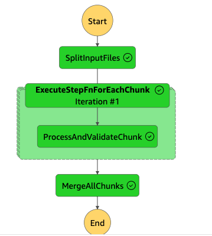

# Email List Sanitizing App using AWS Step Function

## Overview

A tool that helps businesses clean their email lists by removing invalid or inactive email addresses, thus improving their email marketing effectiveness. This project mainly to explain the concept of cleaning email lists using AWS Step function.

## Table of Contents

- [Email List Sanitizing App using AWS Step Function](#email-list-sanitizing-app-using-aws-step-function)
  - [Overview](#overview)
  - [Table of Contents](#table-of-contents)
  - [Demo](#demo)
  - [Architecture Diagram](#architecture-diagram)
  - [State Machine Diagram](#state-machine-diagram)
  - [Tech Stack](#tech-stack)
  - [Serverless Configuration](#serverless-configuration)
    - [Core Components](#core-components)
    - [Functions](#functions)
    - [Resources](#resources)
  - [Challenges](#challenges)
    - [Challenge 1: Scalability](#challenge-1-scalability)
    - [Challenge 2: Cost](#challenge-2-cost)
    - [Challenge 3: Complexity](#challenge-3-complexity)
  - [Solutions](#solutions)
    - [Solution to Challenge 1: Scalability](#solution-to-challenge-1-scalability)
    - [Solution to Challenge 2: Cost](#solution-to-challenge-2-cost)
    - [Solution to Challenge 3: Complexity](#solution-to-challenge-3-complexity)
    - [Prerequisites](#prerequisites)
  - [Installation](#installation)
    - [Server Setup](#server-setup)
    - [Dependacies](#dependacies)
      - [To deploy](#to-deploy)
    - [Client Setup](#client-setup)
    - [Install Dependencies](#install-dependencies)
    - [Environment variable](#environment-variable)

---

## Demo


---

## Architecture Diagram


---

## State Machine Diagram



---

## Tech Stack

**Client:** Nextjs 13, TailwindCSS, [UI(Shadcn)](https://ui.shadcn.com/)

**Server:** Nodejs, AWS Step Functions, AWS SNS, AWS S3, AWS DynamoDB

> **Note:** We mainly use the [Serverless Framework](https://www.serverless.com/) to develop and deploy AWS Lambda functions.

---

## Serverless Configuration

### Core Components

- **Runtime**: Nodejs 16.x
- **HTTP API**: CORS enabled
- **IAM Role Statements**: Allow various AWS services
- **Serverless Plugins**: serverless-offline, serverless-s3-local, serverless-plugin-typescript, serverless-step-functions

### Functions

- **s3EventHandler**: Triggers when a new object is created in the S3 bucket.
- **httpApiHandler**: General HTTP API handler.
- **splitInputFiles**: Splits input email files.
- **processAndValidateChunk**: Processes and validates a chunk of emails.
- **mergeAllChunks**: Merges all processed and validated chunks.

### Resources

- **S3 Bucket**: For file storage.
- **SNS Topic**: For notifications.
- **DynamoDB**: For database requirements.
- **Step Functions**: For orchestrating the email list cleaning.

For more detailed understanding, refer to `serverless.yml`.

---

## Challenges

### Challenge 1: Scalability

Cleaning large email lists can be resource-intensive and time-consuming, making it difficult to scale.

### Challenge 2: Cost

Traditional solutions often require dedicated hardware or expensive software, leading to high operational costs.

### Challenge 3: Complexity

Managing the various steps and operations, such as splitting the email lists, validation, and merging them back, can be complex.

---

## Solutions

### Solution to Challenge 1: Scalability

AWS Step Functions helps us create a serverless workflow, so the system can automatically scale to meet the demands of cleaning large email lists.

### Solution to Challenge 2: Cost

By utilizing AWS services, the operational costs are variable and can be much lower than running dedicated hardware.

### Solution to Challenge 3: Complexity

The state machine in AWS Step Functions organizes the workflow in a clear and visual way, thus simplifying complex tasks like list splitting, validation, and merging.

---

### Prerequisites

You need an AWS Account to deploy AWS Serverless and Step functions.

## Installation

Project mainly split into `client` and `server` side of code.

### Server Setup

### Dependacies

```bash
 cd server
 npm install
```

#### To deploy

```bash
 npm run deploy
```

Once you deploy lambda functions using serverless, you will see the successful deployment as below


### Client Setup

### Install Dependencies

```bash
  cd client
  npm install
```

### Environment variable

Create `.env.local` use add the following environment

```bash
NEXT_PUBLIC_API_URL=
```

Use the Serverless URL from the above deployment in Client side `.env.local`
