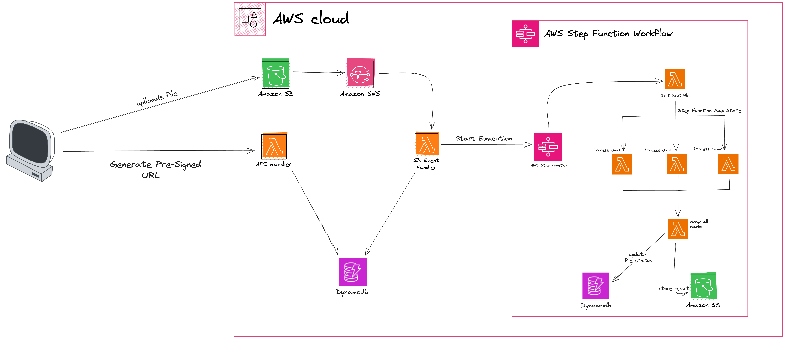
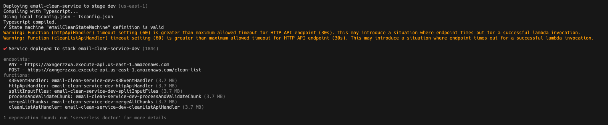

# Email List Sanitizing App using AWS Step Function

A tool that helps businesses clean their email lists by removing invalid or inactive email addresses, thus improving their email marketing effectiveness. This project mainly to explain the concept of cleaning email lists using AWS Step function.

## Demo


## Architecture Diagram



## Tech Stack

**Client:** Nextjs 13, TailwindCSS, [UI(Shadcn)](https://ui.shadcn.com/)

**Server:** Nodejs, AWS Step Functions, AWS SNS, AWS S3, AWS DynamoDB

Note: We mainly uses [Serverless Framework](https://www.serverless.com/) to develop and deploy AWS lambda.

### Prerequisites

You need an AWS Account to deploy AWS Serverless and Step functions.

## Installation

Project mainly split into `client` and `server` side of code.

### Server Setup

### Dependacies

```bash
 cd server
 npm install
```

#### To deploy

```bash
 npm run deploy
```

Once you deploy lambda functions using serverless, you will see the successful deployment as below



### Client Setup

### Install Dependencies

```bash
  cd client
  npm install
```

### Environment variable

Create `.env.local` use add the following environment

```bash
NEXT_PUBLIC_API_URL=
```

Use the Serverless URL from the above deployment in Client side `.env.local`
